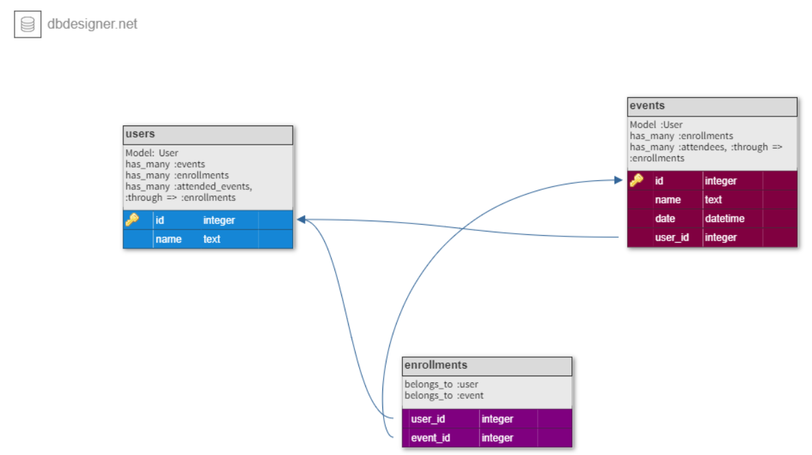

# PRIVATE EVENTS

The private events application is the Rails app. This application has been made for creating a simple app that allows me to practice using device gem, which helps in authenticate users and authorizes some views depends if they are logged in or not. Furthermore, practicing using active records quires and associations.
The reference for this project was made by [THE ODIN PROJECT](https://www.theodinproject.com/paths/full-stack-ruby-on-rails/courses/ruby-on-rails/lessons/associations).

### **_Built With_** 

- Ruby on Rails
- Ruby ( version => 2.7.2 )
- DB DESIGNER
- RSpec

### **_Application's Database Schema_** 


## **_Installation_** 

### **_To get a local copy up and running follow these simple example steps._** 

   1. To clone this repo run this code on a terminal window: 

   ```git clone https://github.com/Maha-Magdy/private-events.git```

   2. install gems by this command

   ```bundle install```

   3. Create the database by this command

   ```rails db: create```

   4. migrate the database by this command

   ```rails db:migrate```

   5. Open rails sever by this command, then follow the link provided to open the application on your browser

   ```Rails server```

   6. Start to create a new user from your server by clicking the sign-Up button, and start to create events by click create event. If you click on available events, you will see all events available. Furthermore, If you create another user, you can enroll in events for other hosts and so on.

**_Note: if webpacker::manifest::missingentry error occurs, you will need to run this command to solve the issue_** 

 ```rails webpacker:install ```

## Authors

### **_Maha Magdy_** 

- GitHub: [Maha-Magdy](https://github.com/Maha-Magdy)
- Twitter: [@Maha_M_Abdelaal](https://twitter.com/Maha_M_Abdelaal)
- LinkedIn: [Maha Magdy](https://www.linkedin.com/in/maha-magdy-abdelaal/)

### **_🤝 Contributing_** 

Contributions, issues, and feature requests are welcome!

Feel free to check the [issues page]( https://github.com/Maha-Magdy/private-events/issues ).

### **_Show your support_** 

Give a ⭐️ if you like this project!

### **_Acknowledgments_** 
[THE ODIN PROJECT](https://www.theodinproject.com/paths/full-stack-ruby-on-rails/courses/ruby-on-rails/lessons/active-record-associations)

### **_📝 License_** 

This project is [MIT](./LICENSE) licensed.
